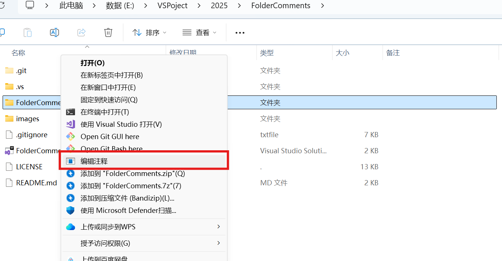
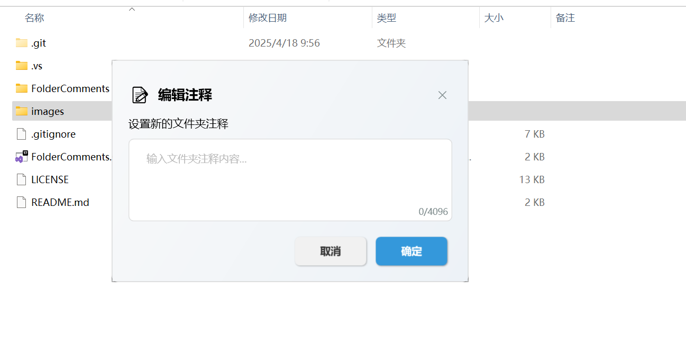
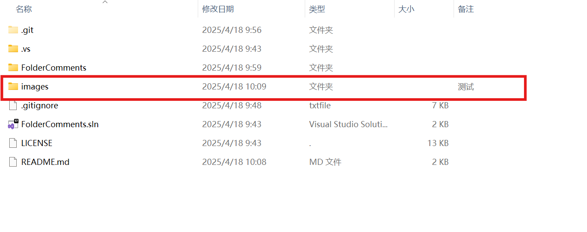

# 📁 文件夹注释 (FolderComments)

一款轻量级WPF应用，帮助您为Windows资源管理器中的文件夹添加注释，并在"注释"列中显示。

  

## ✨ 功能特点

- 🔄 通过Windows资源管理器右键菜单快速添加/编辑文件夹注释
- 👁️ 注释添加后立即在资源管理器的"注释"列中显示，无需刷新
- 🛠️ 使用纯WinAPI实现，性能高效，无需直接修改desktop.ini文件
- 🖱️ 一键集成/移除右键菜单功能

## 📸 使用展示

|右键菜单集成|资源管理器注释列|
|---|---|
|||

添加注释后效果：

  

## 🚀 安装与使用

1. 从[发布页面](https://github.com/YiJiu-Li/FolderComments/releases)下载最新版本
2. 运行程序，点击"添加右键菜单"按钮将功能集成到资源管理器
3. 在任意文件夹上右键点击，选择"编辑文件夹注释"
4. 输入您想添加的注释内容，点击保存

## 🔧 系统要求

- Windows 10/11
- .NET Framework 4.7.2或更高版本

## 📝 版本历史

### v0.1.0
- 首个公开发布版本
- 实现基础的文件夹注释功能
- 支持资源管理器右键菜单集成

## 👏 致谢

本项目基于[publicdomain/folder-comments](https://github.com/publicdomain/folder-comments)改进开发，感谢原作者**mykemo**的创意和贡献。

讨论来源: [注释列功能构想](https://www.donationcoder.com/forum/index.php?topic=1733.0)

## 📄 许可证

[MIT License](LICENSE)

## 🔗 相关链接

- 源代码仓库: [GitHub文件夹注释项目](https://github.com/YiJiu-Li/FolderComments)
